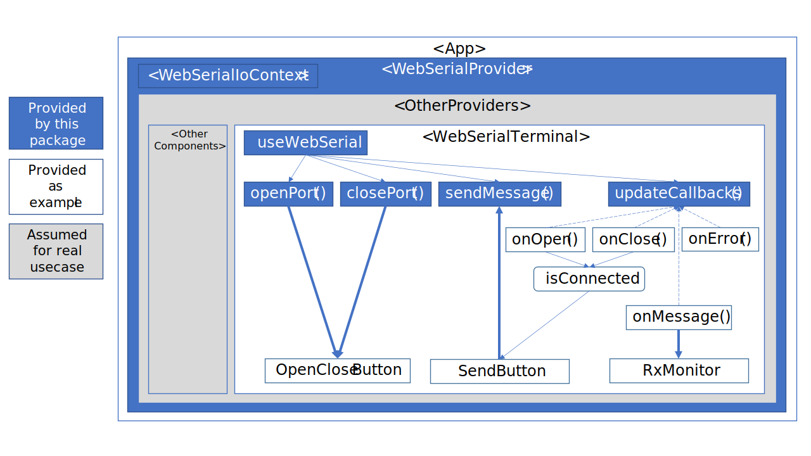

This example was bootstrapped with [Create React App](https://github.com/facebook/create-react-app).

It is linked to the use-react-webserial package in the parent directory for development purposes.

You can test `npm install` and then `npm start` in this directory.
Or access to [Demo page](https://katonobu.github.io/use-react-webserial/).

Basic structure of this example project is as follows.

